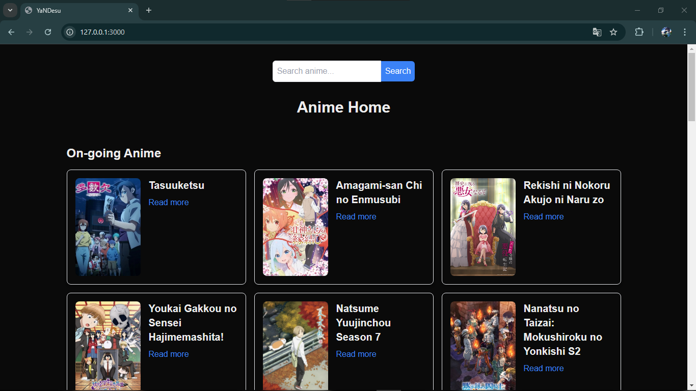
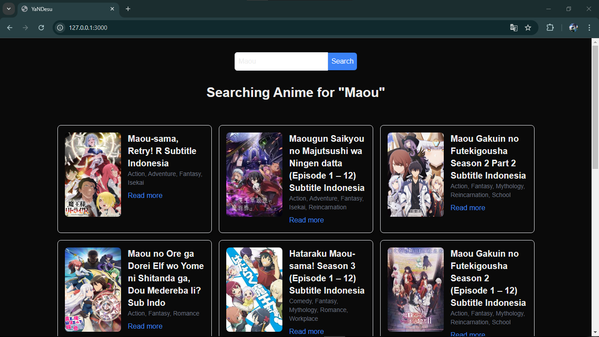
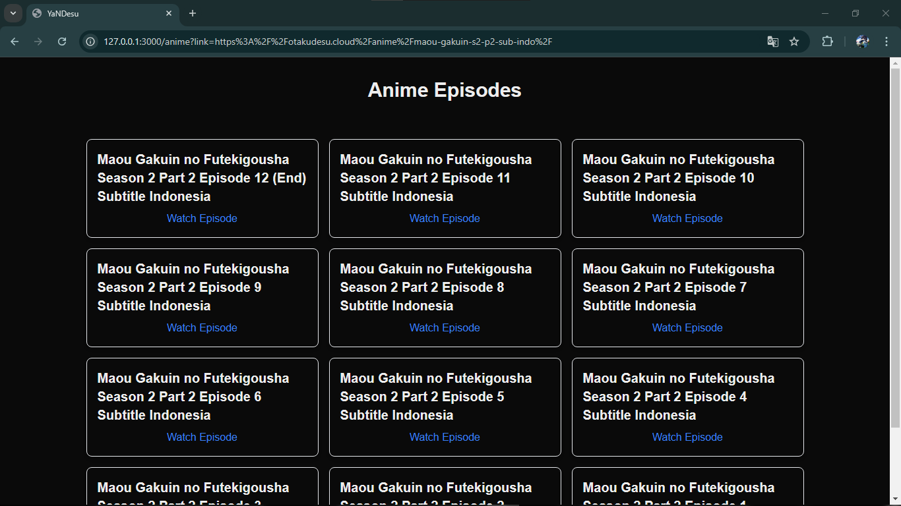
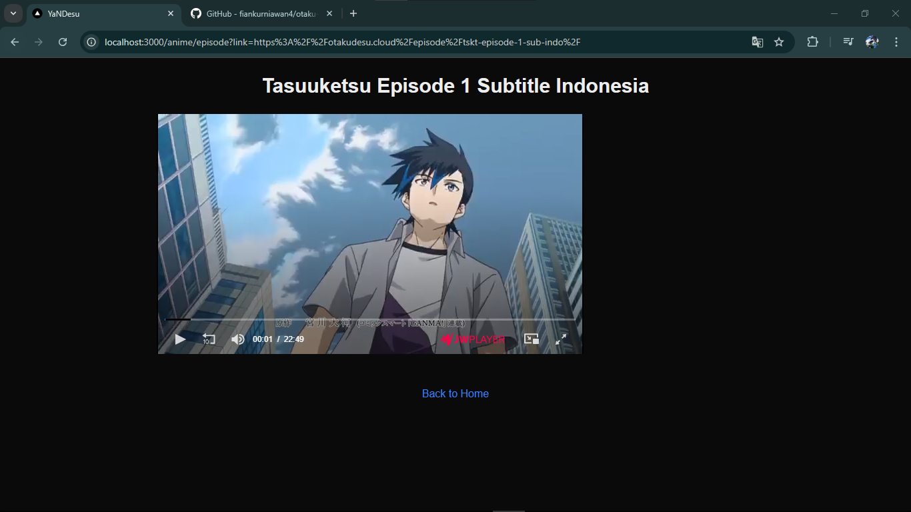

This is a Website to watch an Anime from [Otakudesu](https://otakudesu.cloud/). I create for learning about JS, TS and other.

Using axios and cheerio

## Getting Started

First, run the development server:

```bash
npm install
```

```bash
npm run dev
# or
yarn dev
# or
pnpm dev
# or
bun dev
```

## Picture website




